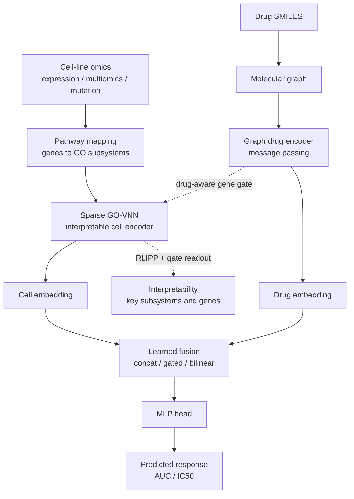

# OncoLens: Holistic Interpretable Drug-Response Pipeline
An interpretable, modular deep-learning pipeline for cancer drug-response prediction that fuses a Gene-Ontology visible neural network with a graph-based drug encoder — combining the strongest ideas from DrugCell, SparseGO, DRPreter, DrugVNN, the Optimal-Fusion study, and PASO.

## About

This package predicts a drug-response value (AUC / IC50) for a (cell line, drug) pair and explains *why* via biological subsystems. It keeps DrugCell's interpretable two-branch design but upgrades every weak axis of the original: the drug is encoded from its molecular **graph** (not a frozen fingerprint), the cell is encoded by a **sparse Gene-Ontology Visible Neural Network**, the two branches interact through a **drug-aware gene gate** and a **learned fusion module** (instead of plain concatenation), and predictions are attributed back to GO subsystems with an **RLIPP-style readout**. Everything runs from two plain config switches so you can scale from a seconds-long synthetic demo up to a full GDSC/CTRP training run.

It is meant as a research scaffold: faithful to the source architectures, readable, and dependency-light (the graph encoder is pure PyTorch — no `torch_geometric`).

## Architecture

### Block diagram


The drug-aware gene gate is drawn crossing between branches because it uses the learned drug embedding to reweight genes feeding the VNN; the interpretability readout is a post-hoc analysis of the trained model, not a trained component.

### Diagram


## Getting Started

### Prerequisites

- Python >= 3.10
- PyTorch >= 2.1, NumPy, pandas (see `requirements.txt`)
- `rdkit` — required only for the GDSC2 real-data loader (to parse SMILES); not needed for Demo mode

### Installation

```bash
pip install -r requirements.txt
```

### Run

From the project root:

```bash
python -m drp/main.py
```

That runs the default configuration (Demo mode), which needs no download and trains in ~1-2 minutes on CPU.

## Usage

You drive everything from two module-level variables at the top of `drp/config.py`:

```python
MODE       = "Demo"        # "Full" | "Subset" | "Demo"
CELL_INPUT = "expression"  # "expression" | "multiomics" | "mutation"
FUSION     = "bilinear"    # "concat" | "gated" | "bilinear"
```

- **`MODE`**
  - `Demo` — synthetic-but-realistic data and a trimmed GO hierarchy. No network. Runs in seconds and produces meaningful (learnable) numbers.
  - `Subset` — the real-data path, capped to a small slice for fast training.
  - `Full` — real GO hierarchy + real GDSC2 data (when configured), no cap.
- **`CELL_INPUT`** selects the pluggable cell-side feature block: continuous gene `expression` (default), combined `multiomics` (expression + mutation + CNV), or binary `mutation` flags.
- **`FUSION`** selects how the cell and drug embeddings combine. `bilinear` is the default because it cleanly carries the cell x drug interaction.

Edit the variables and re-run `python -m drp/main.py`. 

## Reproducible Results

Each run prints the dataset summary, a training trace, Spearman / Pearson / RMSE on train/val/test, and an interpretability readout (top GO subsystems by RLIPP, top genes by the drug-aware attention gate).

Reference run — `MODE=Demo`, `CELL_INPUT=expression`, `FUSION=bilinear`, seed 7, 90 epochs, CPU (~88 s, ~106K parameters):

| Split | Spearman rho | Pearson r | RMSE |
|-------|:------------:|:---------:|:----:|
| Train | 0.757 | 0.757 | 0.181 |
| Val   | 0.609 | 0.621 | 0.213 |
| Test  | 0.663 | 0.664 | 0.206 |

At the default settings a converged Demo run reaches **test Spearman rho ~ 0.66** (train 0.76, val 0.61). The above numbers are on *synthetic, deliberately-learnable* data — it demonstrates the pipeline trains and attributes signal correctly; it is **not** a benchmark score against real drug response, and should not be compared to published DrugCell/SparseGO scores. For reference, DrugCell reported a per-drug median Spearman of roughly 0.37 on real data, which is a harder problem than this synthetic setting.

Two behaviors worth noting from development:

- A stripped dot-product model reaches test rho ~0.93 on this synthetic data, and the sparse GO-VNN + graph drug encoder reach ~0.93 on their own — confirming the encoders are sound and the low-rank signal is learnable.
- In **Full** mode the real DrugCell GO ontology downloads and parses correctly (3,008 genes, 2,086 subsystems). The GDSC/CCLE portal matrices are frequently unreachable from sandboxed environments; when that happens the pipeline prints a clear message and falls back to a Demo run so you always get an end-to-end result.

### Demo experiments

`run_experiment.py` sweeps every `CELL_INPUT` x `FUSION` combination in Demo mode on a fixed seed and tabulates the result:

```bash
python -m drp/run_experiment.py --epochs 45 --csv sweep_results.csv
# restrict to one cell input (faster): --cell-input expression
```

Representative output (Demo, seed 7, 45 epochs/run — enough to rank configs, not to fully converge):

| cell_input | fusion | test_rho | val_rho | train_rho | test_rmse |
|---|---|---|---|---|---|
| expression | concat | -0.012 | 0.023 | 0.166 | 0.280 |
| expression | gated | 0.020 | 0.025 | 0.164 | 0.277 |
| expression | **bilinear** | **0.436** | 0.494 | 0.558 | 0.245 |
| multiomics | concat | 0.091 | 0.062 | 0.175 | 0.283 |
| multiomics | gated | 0.074 | 0.130 | 0.092 | 0.284 |
| multiomics | **bilinear** | **0.481** | 0.493 | 0.559 | 0.248 |
| mutation | concat | -0.027 | 0.023 | 0.013 | 0.276 |
| mutation | gated | -0.070 | 0.008 | 0.189 | 0.281 |
| mutation | **bilinear** | **0.345** | 0.404 | 0.507 | 0.259 |

Two things this shows, both with caveats:

- **Bilinear fusion dominates** on this data. That is partly by construction: the synthetic response is a dot-product interaction, which the bilinear layer captures directly and concat/gated must learn indirectly (they may catch up with more epochs, and on real data the gap can narrow). It still demonstrates that fusion choice matters.
- **Cell-input ordering is multiomics >= expression > mutation.** This matches the biological intuition (richer input, more signal; binary mutation is thinnest), but on synthetic data it is suggestive only — the multiomics channels here derive from the same latent, so do not read the gap as a real-data effect size.

### Real data (Full / Subset)

The GO hierarchy and gene index are fetched from the public DrugCell GitHub mirror (`raw.githubusercontent.com`), which is reachable in most environments. The pharmacogenomic response matrix and CCLE omics live on portals `drugcell.ucsd.edu` and `DepMap` respectively. Point `config.SOURCES['drugcell_all']` and `config.SOURCES['ccle_expression']` at local files (or run where the portals are reachable). Dataset access is governed by the terms of GDSC, CTRP, CCLE/DepMap, and the DrugCell project.

### GDSC2 loader

`drp/real_data.py` loads GDSC2 from three local files and produces the same `Dataset` the model consumes. Set the paths in `config.py`:

```python
MODE = "Subset"   # or "Full"
CELL_INPUT = "expression"
GDSC2_RESPONSE_CSV    = "path/to/GDSC2_fitted_dose_response.csv"
GDSC2_EXPRESSION_CSV  = "path/to/expression_matrix.csv"   # genes x cell lines
GDSC2_DRUG_SMILES_CSV = "path/to/drug_smiles.csv"         # DRUG_NAME,SMILES
```

Then `python -m drp/main.py`. The loader:

- reads the GDSC2 fitted dose-response CSV (label column `AUC` by default; set `GDSC2_TARGET_IS_LN_IC50=True` to use and squash `LN_IC50`),
- aligns the expression matrix to the DrugCell gene order (missing genes -> 0), z-scoring per gene,
- featurizes each drug's SMILES into a molecular graph with **RDKit** (`pip install rdkit`),
- matches cell lines and drugs across files on a normalized key (uppercase, alphanumerics only) and prints how many pairs matched vs. were skipped.

Column names live in `GDSC2Columns` in `real_data.py` and are easy to edit — GDSC has varied them across releases, so if a column is missing the loader prints the columns it actually found. **Check the printed match count**: mismatched cell-line naming between sources is the most common cause of silent data loss.

A tiny **synthetic sample** in this exact schema ships under `sample_data/` so you can exercise the loader without the real files. Those values are random — they test parsing / alignment / featurization only, not model accuracy. Only the `expression` cell input is wired from these three files; `mutation` / `multiomics` need their own matrices (the loader raises a message explaining what to add).

If the response/omics files are absent, `main.py` prints a clear message and falls back to a Demo run so you always get an end-to-end result.

## Run Order

1. install deps (add rdkit only if you'll use the real GDSC2 loader)
```python
pip install -r requirements.txt
pip install rdkit
```

2. (optional) edit the switches at the top of `drp/config.py` - [MODE / CELL_INPUT / FUSION]

3. reproduce the Demo result (metrics + interpretability readout)
`python -m drp/main.py`

4. reproduce the sweep table (CELL_INPUT x FUSION)
`python -m drp/run_experiment.py --epochs 45 --csv sweep_results.csv`

5. real data: set the GDSC2_* paths in `drp/config.py`, then
`python -m drp/main.py`

## Project Structure

```
drp/
  config.py         # the two switches + hyperparameters, data sizing, GDSC2 paths
  hierarchy.py      # GO hierarchy: synthetic builder + real DrugCell-ontology parser
  data.py           # synthetic (learnable) data, graph featurization, real-data router
  real_data.py      # GDSC2 loader: response + expression + SMILES -> Dataset (RDKit)
  sparse_vnn.py     # Sparse GO Visible Neural Network (interpretable cell encoder)
  drug_encoder.py   # pure-PyTorch message-passing graph encoder for drugs
  components.py     # drug-aware gene gate + configurable fusion module
  model.py          # ties the branches, gate, fusion, and head together
  train.py          # batching, training loop, early stopping, metrics
  interpret.py      # RLIPP-style subsystem importance + attention-gate gene ranking
  run_experiment.py # sweep CELL_INPUT x FUSION and tabulate
  main.py           # entry point: reads config, runs, reports
sample_data/        # synthetic GDSC2-format files for testing the loader
```

## Notes and limitations

- The `Demo` numbers reflect a synthetic generative process designed to be *learnable*, not to mimic real-data difficulty; they show the pipeline trains and attributes signal correctly, not a benchmark score.
- The synthetic response is intentionally low-rank, which is the same assumption DrugCell-style models rely on; a full-rank signal would not pass through the model's compact root embedding.
- The real GDSC2 training path (beyond ontology loading) has been exercised on synthetic sample files only; run it on your real files to get real numbers.
- The drug-aware gene gate slightly *reduces* accuracy on the synthetic data (where signal is spread across all genes) but is expected to help on real expression data where only some genes matter per drug; its strength is the `beta` argument in `components.py`.
- The interpretability readout is post-hoc analysis of a trained model, not a trained component.
- The sparse VNN processes subsystems in a Python loop over the hierarchy; clear and faithful, but not the fastest possible implementation for very large ontologies.

## References

This pipeline synthesizes ideas from the following works. Please cite the original papers when using the corresponding components.

1. **DrugCell** — Kuenzi BM, Park J, Fong SH, Sanchez KS, Lee J, Kreisberg JF, Ma J, Ideker T. *Predicting Drug Response and Synergy Using a Deep Learning Model of Human Cancer Cells.* Cancer Cell. 2020;38(5):672–684.e6. doi:10.1016/j.ccell.2020.09.014 · [github.com/idekerlab/DrugCell](https://github.com/idekerlab/DrugCell)
2. **DRPreter** — Shin J, Piao Y, Bang D, Kim S, Jo K. *DRPreter: Interpretable Anticancer Drug Response Prediction Using Knowledge-Guided Graph Neural Networks and Transformer.* Int J Mol Sci. 2022;23(22):13919. doi:10.3390/ijms232213919 · [github.com/babaling/DRPreter](https://github.com/babaling/DRPreter)
3. **SparseGO** — Sada Del Real K, Rubio A. *Discovering the mechanism of action of drugs with a sparse explainable network.* eBioMedicine. 2023;95:104767. doi:10.1016/j.ebiom.2023.104767 · [github.com/KatynaSada/SparseGO](https://github.com/KatynaSada/SparseGO)
4. **DrugVNN** — Xie J, Zhang Z, Li Y, Rao J, Yang . *Interpretable Drug Response Prediction through Molecule Structure-aware and Knowledge-Guided Visible Neural Network.* bioRxiv 2024 (preprint, not peer-reviewed). doi:10.1101/2024.02.07.579280 · [github.com/biomed-AI/DrugVNN](https://github.com/biomed-AI/DrugVNN)
5. **Optimal Fusion** — Nguyen T, Campbell A, Kumar A, Amponsah E, Fiterau M, Shahriyari L. *Optimal fusion of genotype and drug embeddings in predicting cancer drug response.* Brief Bioinform. 2024;25(3):bbae227. doi:10.1093/bib/bbae227 · [github.com/nguyentr17/drug-cell-fusion](https://github.com/nguyentr17/drug-cell-fusion)
6. **PASO** — Wu Y, Chen M, Qin Y. *Anticancer drug response prediction integrating multi-omics pathway-based difference features and multiple deep learning techniques.* PLOS Comput Biol. 2025;21(3):e1012905. doi:10.1371/journal.pcbi.1012905 · [github.com/queryang/PASO](https://github.com/queryang/PASO)

## License

Released under the MIT License — see [LICENSE](LICENSE).
